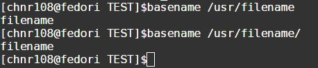
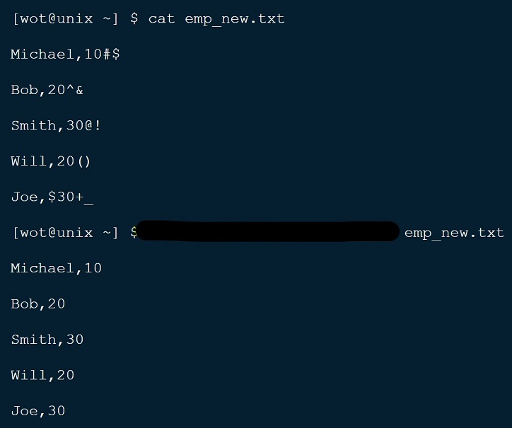

### UNIX INTERVIEW QUESTIONS AND ANSWERS – 1 

#### 1) How can you write the contents of multiple files in current directory to a single file?
```
tmp=$(date "+%Y-%m-%d-%H:%M:%S")
cnt=1
for file in `ls ./`;do
    if [ -f $file ]; then
        cat $file >> tmp
        cnt=$((cnt+1))
    fi
done
mv tmp "file"$cnt
```

#### 2) How can I reverse a word like ‘Unix’ to ‘xinU’ ?
```
echo Unix | rev
```

#### 3) How to display the fields in a text file in reverse order?

**Sulution-1**
```
awk '
{
    for(i=NF; i>0; i--){
        if(i == NF){
            s[NR] = $i;
        }else{
            s[NR] = s[NR] " " $i;
        }
    }
    print s[NR];
}
' file
```

**Solution-2**
```
awk ' BEGIN {ORS=""} 
{ 
    for(i=NF;i>0;i--){ 
        print $i," "; 
        print "\n"
    }
}' filename
```

#### 4)Write a command to find the sum of bytes (size of file) of all files in a directory.
```
ls -l | grep -v / | awk 'BEGIN{sum=0;}{sum+=$5;}END{print sum;}'
```

#### 5) Write a command to print the lines which end with the word “unix”?
```
grep -P "unix$" file
```

#### 7) How to remove the first 2 lines from a file?
```
sed -i '1,2 d' file
```

#### 11) Write a command to list the files in ‘/usr’ directory that start with ‘bo’ and then display the number of lines in each file?
```
for f in `ls /usr`;
do
    if [[ -f $f ]] && [[ "$f" =~ ^bo.*$ ]]; 
    then
        wc -l $f
    fi
done
```
or
```
wc -l /usr/bo*
```
or
```
find /usr -name 'bo*' -type -f -exec wc -l {} \
```

#### 12) How to remove blank lines in a file?
```
sed -i '/^$/d' file
```

#### 13) Write command to remove the prefix of the string ending with ‘/’?
for example:


```
str="/hello/"
echo $str | awk -F'/' '{ if("" == $NF){  print $(NF-1);} else { print $NF;}}'
```

#### 14) How to display zero byte size files?
```
ls -lrt | awk '{if($5==0) print $NF;}'
```
or
```
find $dir -size 0
```

#### 15) How to replace the second occurrence of the word “unix” with “linux” in a file?
```
1. vim file
2. /unix
3. find second unix
4. replace unix with linux
```
or
```
sed -i 's/unix/linux/2' file
```

#### 16) How to remove all the occurrences of the word “unix” except the first one in a line with in the entire file?
```
sed 's/unix//2g' filename
```

#### 17) How to replace the word “unix” with “linux” from 3rd line to last line in a file?
```
sed -i '3,$ s/unix/linux/g' file
```

#### 18) How to list the files that are accessed 3 days ago in the current directory?
```
find -atime 3 -type f
```    

#### 19) How to list the files that were modified 3 days ago in the current directory?
```
find -mtime 3 -type f
```

#### 20) How to list the files whose status is changed 3 days ago in the current directory?
```
find -ctime 3 -type f
```

#### 25) How can you display the duplicates in a file?

‘uniq -d’ command is useful to display duplicates from a file.
```
sort emp_data.txt | uniq -d
```

#### 26) I have a one file which contains employee name and department number in it. Can you display the employee count by GROUP BY department number?

```
cut -d ',' -f2 emp_data.txt | sort | uniq -c
```

#### 28) Differentiate cmp command from diff command in Unix?

 The cmp command is used mainly to compare two files byte by byte, after which the first encountered mismatch is shown. On the other hand, the diff command is used to indicate the changes that is to be made in order to make the two files identical to each other.


#### 29) How would you count every occurrence of the term “unix” in all the files appearing under the current directory, and its subdirectories, recursively? 

```
grep -orI unix . | wc -l
```

To list every occurrence of the term “unix” on a separate line, one must run grep `-o` unix <path>. Adding the ‘r’ option to the command makes the search recursively process every file under the given path, and the ‘I’ option ensures that matches in binary files are ignored. In addition, the ‘w’ option can be included to match the exact term only, and ignore superstrings such as “unixsystem”, and to make the search case-insensitive, the i flag can be added as well:

```
grep -iworI unix . | wc -l
```

#### 30) How would you write a shell script that prints all the additional arguments passed to it in reverse order?

```
for (( i=${#}; i>0; i-- )); do
    echo $i
done
```

The arguments are available as ${n}, where n is the position of the argument. 

For example, $0 would give the name of the script, $1 would give the first additional argument, $2 the second, and so on. The total number of additional arguments is found in ${#}.

A loop that starts at ${#} and ends at 1 can be used to print each additional argument in reverse order.

#### 31) What would be a simple way to continuously monitor the log file for a service that is running?

```
tail -F $LOGFILE 
```
w to print tomorrow’s date in Unix?

$LOGFILE is an environment variable corresponding to the path to the log file to be monitored.

By default, the Linux tail command prints the last 10 lines of a file to standard output. The -F option causes additional file content to be displayed in real time as the file continues to grow. This yields a simple mechanism for monitoring services via their log files in close to real time.

Two other specific command line options of interest in this context are:

The -s option causes tail to sleep for a specified number of seconds between updates (e.g., ‘tail -F -s 10’ will update the displayed file contents roughly every 10 seconds rather than in close to real time as the file is updated).

The -n option can be used to specify a number of lines other than 10 to initially display (e.g., ‘tail -n 20 -F’ will first display the last 20 lines of the file and will then continue updating the output in realtime).

#### 32) How do you insert a new line or text after every n lines in Unix?
```
awk '{
    if(NR%n==0){
        print $0;
        print newline;
    }else{
        print $0;
    }
}' file
```

#### 33) How to remove the Control-M character from a file in Unix?
```
sed -i 's/^M//g' file
```

#### 34) How to print tomorrow’s date in Unix?
```
date -d '1 day'
```

#### 35) How will you find which operating system your system is running on in Unix?
```
uname -a
```

#### 36) How will you run a process in background? How will you bring that into foreground and how will you kill that process?
```
... >/dev/null 2>&1 &
```
- 0表示标准输入
- 1表示标准输出
- 2表示标准错误

#### 37) How do you copy file from one host to other?
```
scp src target
scp local_file remote_username@remote_ip:remote_folder 
```

#### 38) How do you check how much space left in current drive?
```
df -h
```


#### 39) Write a command to display the first 5 characters from each line of a file?
```
cat file | cut -c 1-5
```

#### 40) What is the significance of `$?` ?
`$?` gives the exit status of the last command that was executed.
- 0 (Zero) – means command returns successful.
- Non Zero – means command returns unsuccessful.


在写脚本是可以用来判断上一条命令的执行情况。

#### 41) I have a file like below which contains special characters in the 2nd column and I want to clean the file by having only alphanumeric values in the file. How can I do that?
```
Michael,10#$
Bob,20^&amp;amp;amp;
Smith,30@!
Will,20()
Joe,$30+_
```


```
sed -E 's/[^a-zA-Z0-9,]//g' file
```

#### 42) I want to create a directory when that directory does not exist and if directory exists it should not return any error?
```
if [! -e directory ]; then
    mkdir directory
fi
```

#### 43) How to count the number of columns in each row in a text file?
```
awk -F',' '{print NF;}' file
```

#### 45) I have one file with 4 records, 2 columns and 1 trailer record like below:
```
Green,10
Red, 30
Blue,60
100
```
I want to calculate sum of the second column values and need to check whether that total sum is equal to trailer record value i.e.100?

Below shell script can used to calculate sum of the values in the columns and compare the sum with the total value in trailer record.

```
awk -F',' 'BEGIN{ SUM=0;TOTAL=0;}
{
    if($2 == ""){
        TOTAL = $1;
    }else{
        SUM += $2;
    }
}
END{
    print "TOTAL " TOTAL;
    print "SUM " SUM;
    if(SUM == TOTAL){
        print "matched!";
    }else{
        print "no matched!";
    }
}' $1
```
